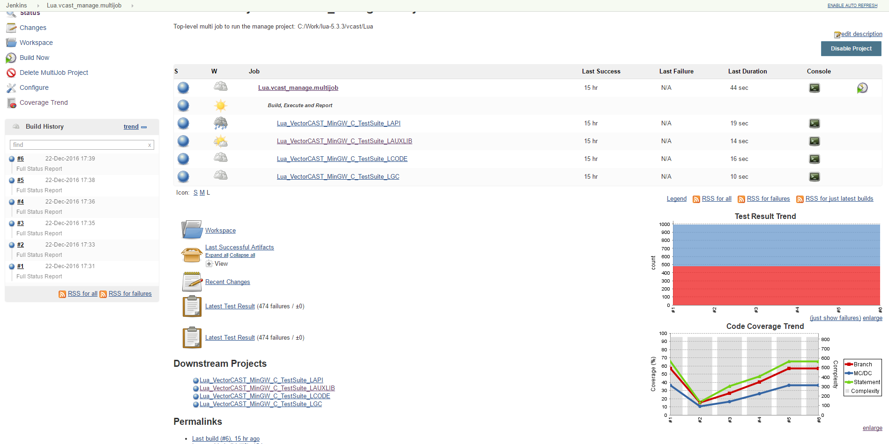
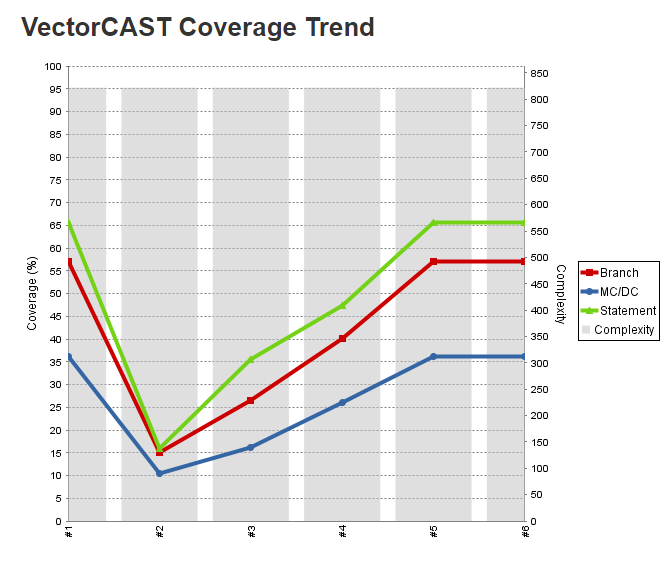
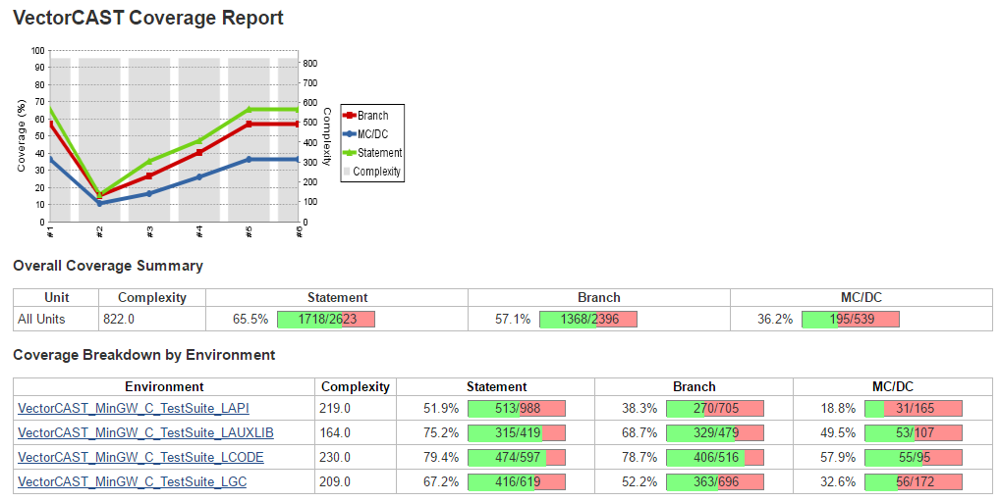
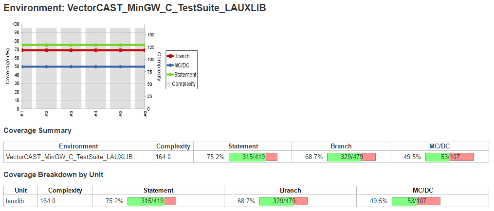

Processes code coverage metrics from for
[VectorCAST](http://vector.com/vectorcast) Projects

# Summary

This is a fork of the Emma-plugin; all existing components maintain the existing license. New files are licensed under MIT. Moved or renamed files maintain their old license, and their history can be seen by looking at the source control revision logs.

This plugin allows you to capture code coverage reports from VectorCAST Projects. Jenkins will generate the trend report of coverage. This plugin is used automatically with the 
[VectorCAST Execution Plugin](https://plugins.jenkins.io/vectorcast-execution)

Coverage information from tests runs that has been converted to XML files is read and displayed by this plugin. It shows coverage trends and allows drilling down to more detailed coverage informantion

# Usage

This plugin displays coverage and coverage trend data from running VectorCAST/Manage projects with the VectorCAST Execution Plugin. It is added as a dependency to the execution plugin and is automatically used to display coverage data.

The top page of a job will contain coverage trend graph

Both the small coverage trend graph and 'Coverage Trend' menu on the left can be clicked on. Clicking on the 'Coverage Trend' menu will show a full page coverage trend graph.

Clicking on either the small or large coverage trend graph will show more information and so on as you click on additional links

## Known Issues
None

## Change Log

### Version 0.22 (22 Mar 2023)
- Bumped dashboard-view from 2.16 to 2.18.1 
  - Updated minimum Jenkins version to 2.361
  - Upgraded to Java 11
  - Upgraded TimeLocal from org.joda.time to java.time
  - Updated dependencies 
- Upgraded from findbugs to spotbugs
- Cleaned up bugs found with spotbugs
- Fixed coverage history to look for SUCCESS or UNSTABLE builds.

### Version 0.21 (31 Jan 2023)
- Fix to support jobs configured with older coverage plugins

### Version 0.20 (26 Dec 2022)
- Added option to control build status based on decreased code coverage
- Fixed find-bugs and javadoc issues
- Fix Temporary Directory Hijacking or Information Disclosure Vulnerability #9

### Version 0.19 (26 Aug 2021)
- Fixed snippet generator 
- Fixed health reports for pipeline

### Version 0.18 (10 Aug 2021)
- Use HTTPS URLs in pom.xml
- Bump dashboard-view from 2.1 to 2.16

### Version 0.17 (5 May 2021)
- Upgrade to commons-digester3

### Version 0.16 (20 Jan 2021)
- Fixed misalignment of charts with an environmnent has no coverage

### Version 0.15 (8 Dec 2020)
- Fixed remote read hang up problem

### Version 0.14 (12 Aug 2019)
- Additional debug logging

### Version 0.13 (10 May 2019)
- Add SimpleBuildStep usage to support freestyle jobs.

### Version 0.12 (26 Apr 2019)
- Update for additional chart fixes

### Version 0.11 (25 Apr 2019)
- Trend Chart not updating correctly with all coverage metrics at 0

### Version 0.10 (7 Dec 2016)
- Support for displaying top-level coverage calculated by VectorCAST Execution Plugin scripts

### Version 0.9 (18 Nov 2016)
- Initial release
